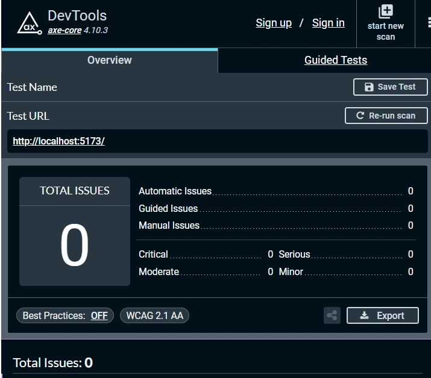

<h2 align="center">
  Dynamic JSON Schema Form (React + Vite)
</h2>

This is a lightweight React app that dynamically renders forms based on a provided JSON schema.

## 🚀 Getting Started

Clone the project and install dependencies:

```bash
git clone https://github.com/elienemb/dynamic-form.git
cd dynamic-form
npm install
npm run dev
```

The app will be available at [http://localhost:5173](http://localhost:5173)

## ⚙️ Features

- Dynamic form rendering from JSON schema
- Validation for required fields
- Modular and reusable component structure
- Easily extendable for more field types (textarea, checkbox, select, etc.)
- Real-time JSON output on form submit

## 🛠️ Built With

- [React](https://react.dev/)
- [Vite](https://vitejs.dev/)
- [Tailwind CSS](https://tailwindcss.com/)
- [JavaScript](https://developer.mozilla.org/en-US/docs/Web/JavaScript)
- [Vitest](https://vitest.dev/) for unit testing

## 🎨 Styling

Tailwind CSS is used for fast and utility-first styling. The setup follows the [official Vite + Tailwind guide](https://tailwindcss.com/docs/guides/vite).

Tailwind directives used in `src/index.css`:

```css
@import "tailwindcss";
```

## 🔬 Unit Testing

This project uses [Vitest](https://vitest.dev/) for unit testing. Tests cover the `validateForm()` function to ensure correct handling of required and optional fields.

#### 📁 Test location

```
src/utils/validateForm.test.js
```

#### ▶️ Run tests

```bash
npm run test
```

## ♿ Accessibility Audit

This form was tested using [axe DevTools](https://www.deque.com/axe/devtools/) and passed with **0 accessibility issues**.



## 📝 License

This project is for technical evaluation purposes only.